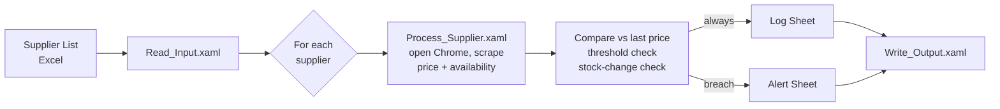

# Supplier Price & Availability Monitor — UiPath RPA

An attended RPA bot that automates a procurement team's daily supplier monitoring: it visits each supplier's product page, scrapes the current price and stock status, compares against the last known price, and raises alerts when a price moves past a per-supplier threshold or availability changes — replacing a 60–90 minute manual routine with a run of under 10 minutes.

Built with **UiPath Studio** (Windows, VB.NET expressions) against a formal **Process Design Document** produced by a six-person team (business analysts, developers, tester, solution architect).

> **Final version:** [`Procurement Automation/`](Procurement%20Automation/) — the other project folders are earlier iterations, kept to show the build progression (see [Evolution](#evolution) below).

## What it does

- **Input:** `SUPPLIER LIST TEMPLATE.xlsx` — supplier name, product ID, URL, per-supplier alert threshold, last known price and stock status for 7 real suppliers (Adorama, B&H Photo, Micro Center, Insight, Micro Card, Tomauri, Canada Computers).
- **Scraping:** per-supplier UI Automation selectors (each retailer's price element differs), regex price cleaning (`[0-9\.,]+`), an add-to-cart heuristic when availability text is missing, and hardcoded reference-price fallbacks so a broken selector degrades gracefully instead of crashing the run.
- **Business rules (from the PDD):** alert when `|new − old| / old ≥ threshold` (default 5%) **or** stock status changes; every check is logged with a timestamp; a missing price is logged as `N/A` + "Price Not Found" without raising a false alert or overwriting the seed price.
- **Output:** the same workbook — refreshed Supplier List, append-only Log Sheet (audit history), and Alert Sheet for the procurement analyst.

## Evolution

| Stage | Folder | What it proves |
|---|---|---|
| 1. Config skeleton | `final exam practice/` | Initial design: config vocabulary, sheet layout, threshold defaults |
| 2. Plumbing prototype | `Tecchnova Automation/` | End-to-end read → loop → write proven with stub data before any scraping; PowerShell scripts used to reverse-engineer the workbook layout |
| 3. First real scraper | `Technova Automations/` | Live browser scraping for all 7 suppliers, threshold + stock-change alert logic, text run-log |
| 4. **Final** | `Procurement Automation/` | Refactor to named columns, per-supplier thresholds read from the sheet, input cleaning, graceful price-not-found handling |

## Debugging & verification story

After the project left the original development machine, the committed copy had two hand-edit corruptions (duplicated XAML tags) that prevented UiPath Studio from loading it at all. Restoring it turned into a full verification exercise against the PDD:

1. **Validated all 36 workflow files** as well-formed XML and repaired the two corrupted ones.
2. **Replayed the workflow logic expression-by-expression** against the real workbook (outside UiPath) and compared the results to the run history recorded in the Log Sheet.
3. **Found and fixed five logic defects** the original runs had silently suffered:
   - a threshold unit bug (sheet stores `0.05` meaning 5%; the code divided by 100 again, alerting on 0.05% moves),
   - supplier-name mismatches between the spreadsheet and the code's fallback dictionaries,
   - a case-sensitive `Switch` key that could never match,
   - four scraper branches that computed prices but never exported them to the caller,
   - false −100% alerts (and seed-price destruction) whenever a price couldn't be scraped — now handled per the PDD's exception rules.
4. **Re-verified:** all 7 suppliers resolve prices, only genuine ≥5% moves or real stock changes alert, and unknown suppliers log cleanly without corrupting data.

## Running it

Requires Windows with UiPath Studio (Community), Chrome with the UiPath extension, and Microsoft Excel.

1. Open `Procurement Automation/project.json` in UiPath Studio.
2. Update the workbook path in `Main.xaml`, `Read_Input.xaml`, and `Write_Output.xaml` to your local copy of `SUPPLIER LIST TEMPLATE.xlsx`.
3. Run `Main.xaml`. Results land in the workbook's Log Sheet and Alert Sheet.

Web selectors are tuned to each retailer's page structure as of development time; if a site has since redesigned, that supplier falls back to its reference price (by design) until the selector is refreshed.

## Known limitations

Documented honestly, per the PDD's out-of-scope and future-phase sections: no navigation retry loop yet (a dead site aborts the run rather than skipping the row), no exception-notification emails, no red/green conditional formatting on the Alert Sheet (a prototype exists, disabled, in the stage-3 iteration), and the add-to-cart availability heuristic is implemented for one supplier.
